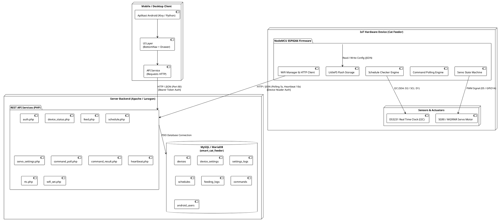
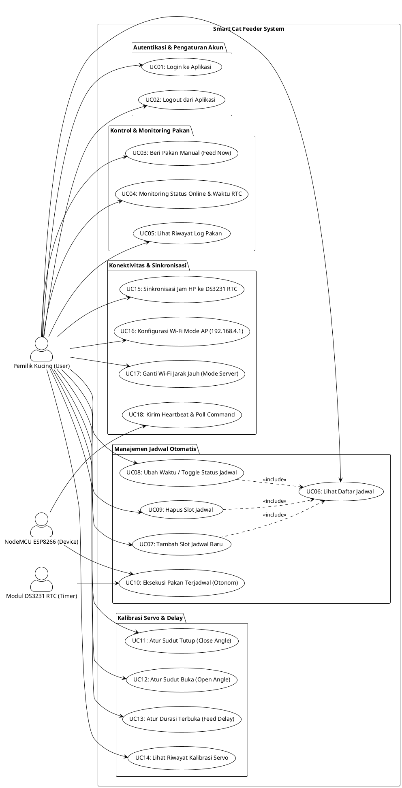
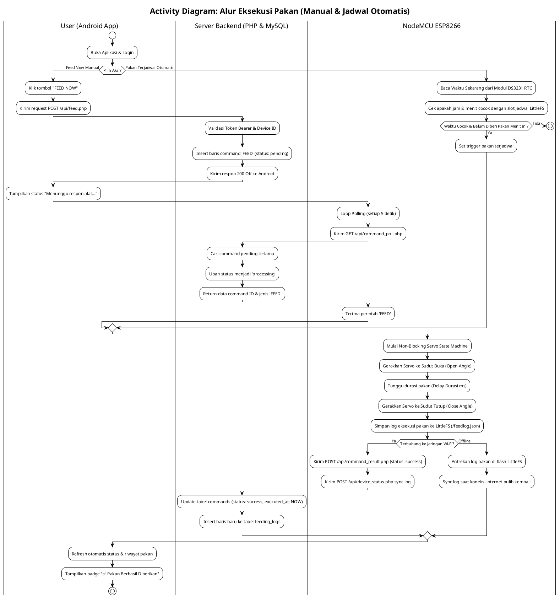
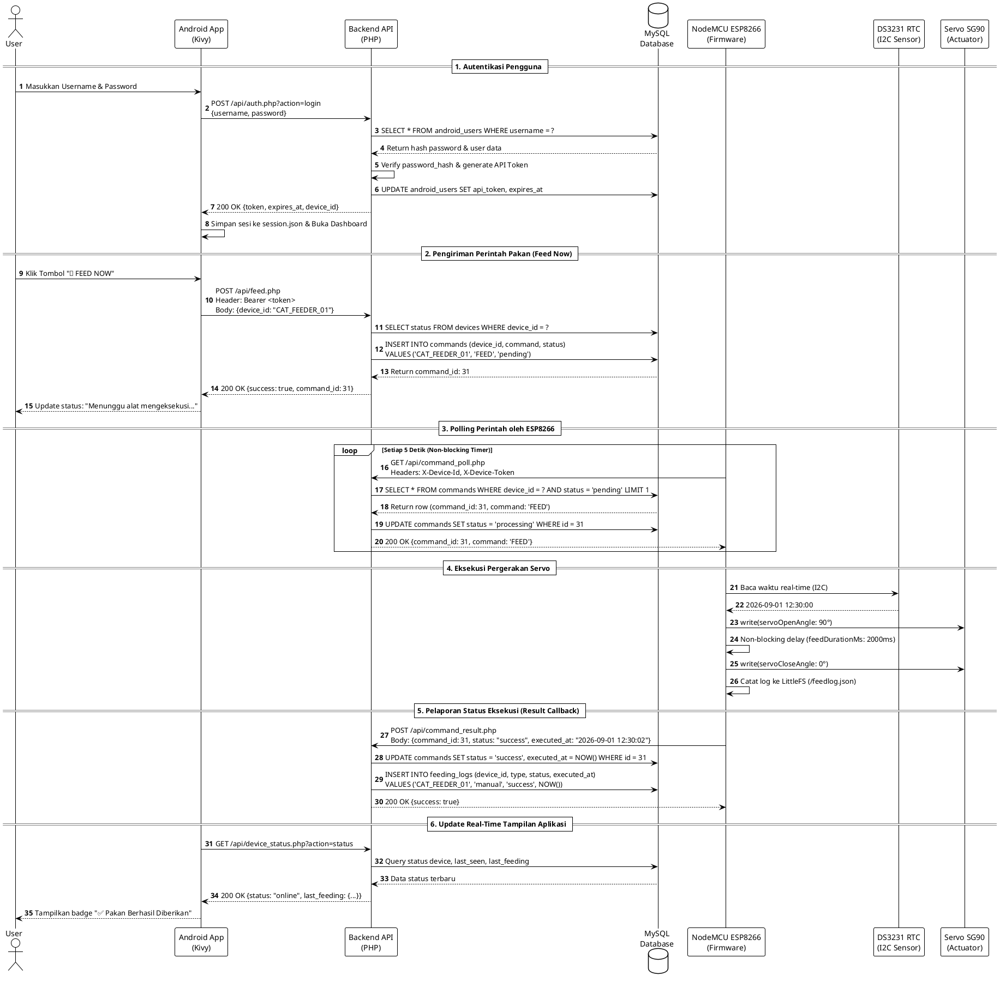
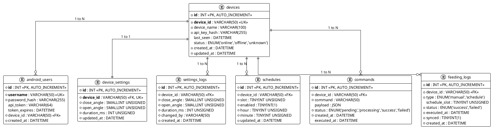
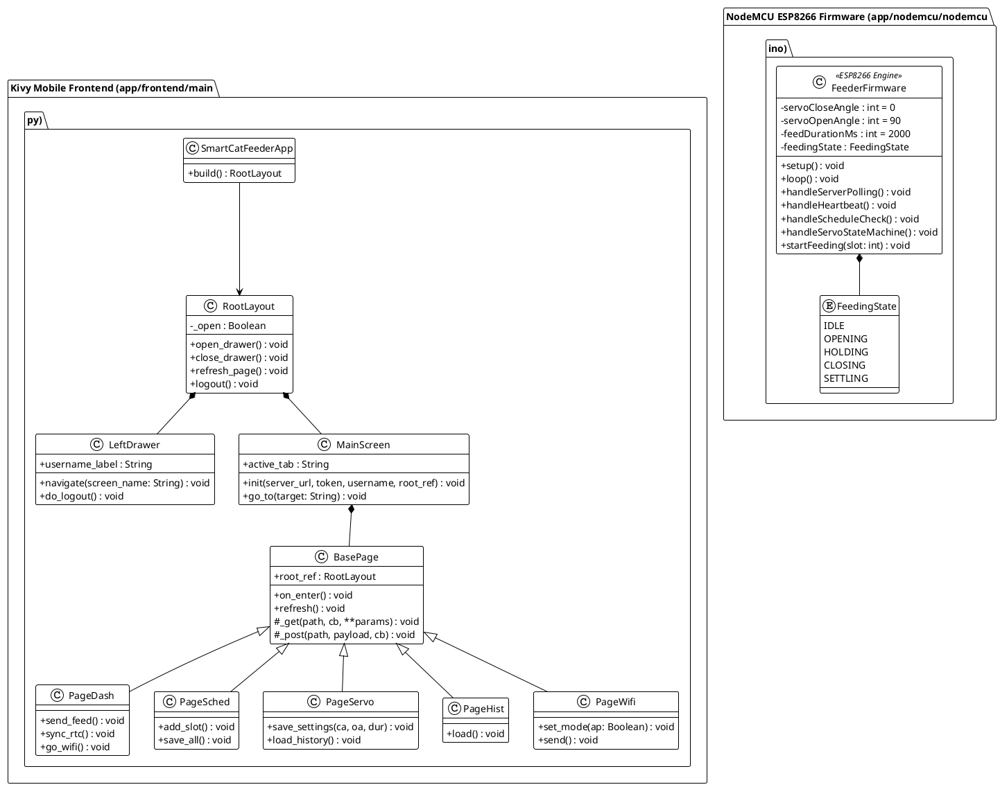
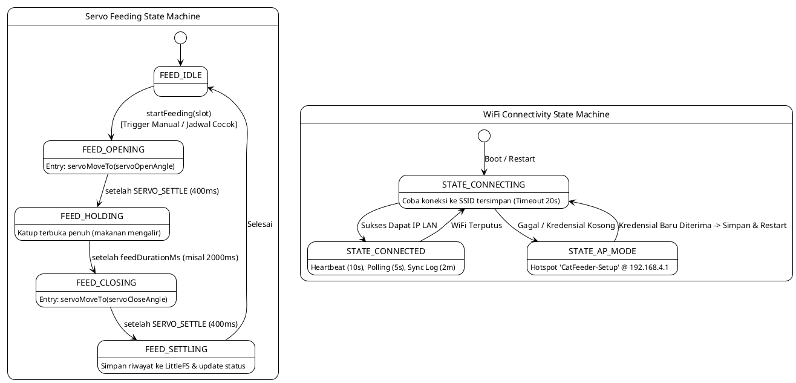

# 📚 Dokumentasi Teknis & Desain UML: Smart Cat Feeder Pro

Dokumen ini berisi spesifikasi perancangan sistem **Smart Cat Feeder Pro** secara komprehensif menggunakan diagram standar **UML (Unified Modeling Language)** dan **PlantUML**.

---

## 📑 Daftar Isi Diagram
1. [🏛️ Desain Arsitektur Sistem (System Architecture & Deployment)](#1-desain-arsitektur-sistem)
2. [👥 Use Case Diagram](#2-use-case-diagram)
3. [🔄 Activity Diagram (Alur Kerja Pakan & Kalibrasi)](#3-activity-diagram)
4. [⏱️ Sequence Diagram (Interaksi End-to-End & Polling)](#4-sequence-diagram)
5. [🗄️ Entity Relationship Diagram (ERD Database)](#5-entity-relationship-diagram-erd)
6. [🧱 Class & Component Diagram](#6-class--component-diagram)
7. [⚙️ State Machine Diagram (Firmware Lifecycle)](#7-state-machine-diagram)

---

## 1. 🏛️ Desain Arsitektur Sistem
Diagram arsitektur menggambarkan pembagian 3 tier utama:
- **Client Tier:** Aplikasi Android/Desktop berbasis Python & Kivy dengan custom UI (BottomNav + Drawer).
- **Server Tier:** Backend REST API berbasis PHP PDO & Database MySQL (Laragon / Web Server).
- **IoT Hardware Tier:** NodeMCU ESP8266 dengan modul RTC DS3231 (I2C) & Motor Servo SG90/MG996R (PWM).

---

## 2. 👥 Use Case Diagram
Menggambarkan interaksi antara **Pemilik Kucing (User)**, **NodeMCU ESP8266 (Device)**, dan **Modul DS3231 RTC (Timer)** terhadap fitur-fitur sistem.

---

## 3. 🔄 Activity Diagram
Menggambarkan alur aktivitas pemberian pakan baik secara **Manual (Feed Now)** maupun **Otomatis Berbasis Waktu RTC DS3231**.

---

## 4. ⏱️ Sequence Diagram
Menggambarkan urutan pertukaran pesan antar aktor dan komponen saat perintah pakan instan dikirimkan.

---

## 5. 🗄️ Entity Relationship Diagram (ERD)
Struktur entitas database relasional `smart_cat_feeder` di MySQL / MariaDB.

---

## 6. 🧱 Class & Component Diagram
Struktur kelas object-oriented pada aplikasi Frontend Python Kivy dan Firmware ESP8266.

---

## 7. ⚙️ State Machine Diagram
Siklus pergerakan servo non-blocking dan penanganan konektivitas Wi-Fi (AP Hotspot vs Client Station).

---

## 🛠️ Cara Render / Ekspor Diagram PlantUML
File-file diagram individual berekstensi `.puml` tersimpan di direktori:
👉 **[`docs/plantuml/`](file:///c:/Users/LENOVO/Desktop/Pakan-kucing/docs/plantuml/)**

Untuk mengonversi diagram menjadi file gambar PNG/SVG:
1. **Online:** Copy-paste kode ke [PlantUML Online Server](https://www.plantuml.com/plantuml/uml/).
2. **VS Code:** Gunakan ekstensi *PlantUML* (oleh Jebbs) dan tekan `Alt + D` untuk preview langsung.
3. **CLI:** Jalankan `java -jar plantuml.jar docs/plantuml/*.puml`.
