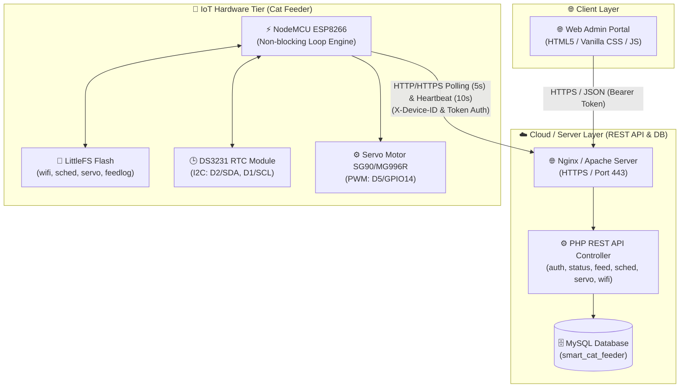
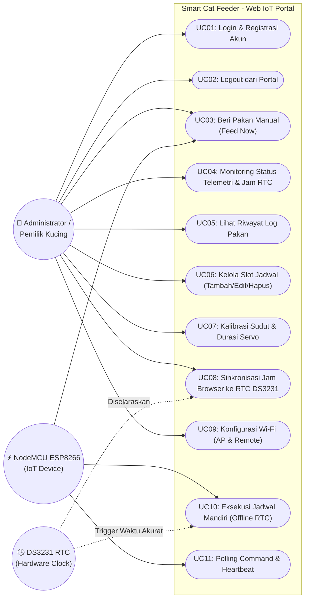
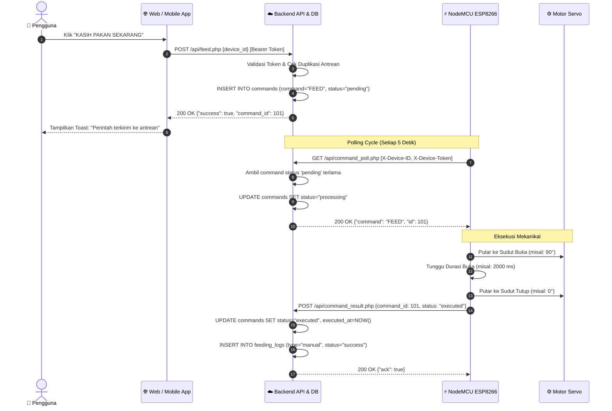
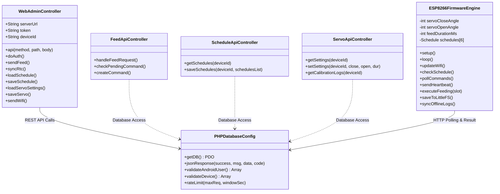
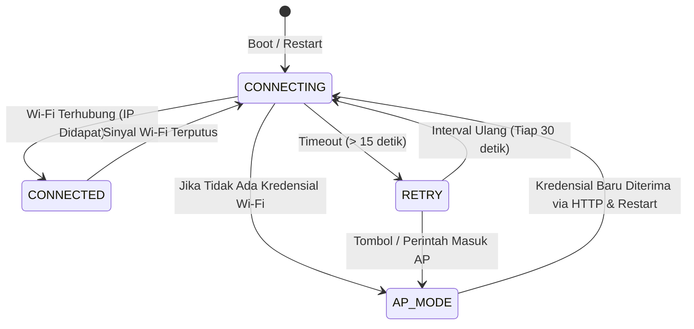
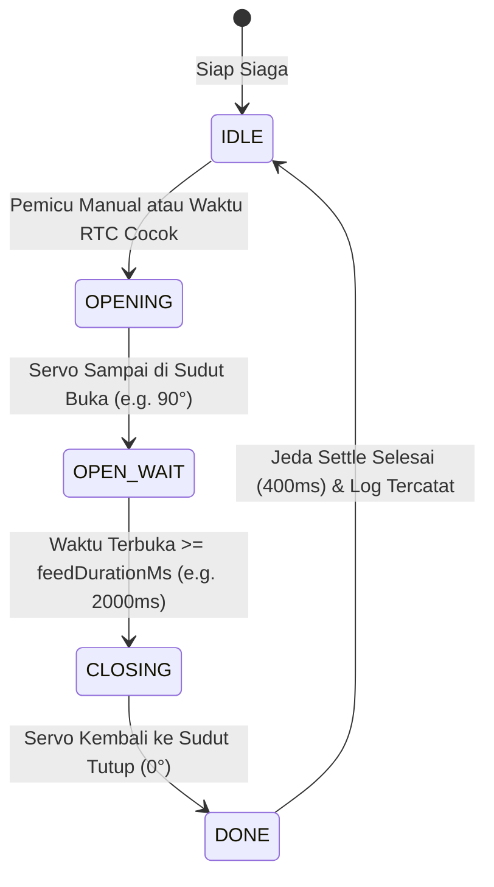

# 📚 Dokumentasi Teknis & Diagram UML: Smart Cat Feeder Pro

> **Sistem Otomasi Pakan Kucing Berbasis IoT (ESP8266 + DS3231 RTC + REST API + Web Admin & Mobile Client)**  
> Versi Dokumen: `2.0.0` | Terakhir Diperbarui: `September 2026`

---

## 📑 Daftar Isi
1. [🏛️ 1. Arsitektur Sistem (System Architecture)](#1-arsitektur-sistem-system-architecture)
2. [👥 2. Use Case Diagram](#2-use-case-diagram)
3. [🔄 3. Activity Diagram (Alur Kerja Utama)](#3-activity-diagram-alur-kerja-utama)
4. [⏱️ 4. Sequence Diagram (Interaksi Komunikasi)](#4-sequence-diagram-interaksi-komunikasi)
5. [🗄️ 5. Entity Relationship Diagram (ERD Database)](#5-entity-relationship-diagram-erd-database)
6. [🧱 6. Class Diagram & Struktur Komponen](#6-class-diagram--struktur-komponen)
7. [⚙️ 7. State Machine Diagram (NodeMCU Firmware)](#7-state-machine-diagram-nodemcu-firmware)
8. [🔌 8. Spesifikasi Pinout & Pengkabelan Hardware](#8-spesifikasi-pinout--pengkabelan-hardware)
9. [🌐 9. Ringkasan Spesifikasi REST API](#9-ringkasan-spesifikasi-rest-api)

---

## 1. 🏛️ Arsitektur Sistem (System Architecture)

Sistem **Smart Cat Feeder Pro** dibangun menggunakan arsitektur **3-Tier Distributed IoT**:
- **Client Tier:** Web Administrator Portal (HTML5 / Vanilla CSS / JavaScript) yang responsif untuk Desktop, Tablet, dan Smartphone.
- **Server Tier:** REST API Backend berbasis PHP PDO dengan database relasional MySQL/MariaDB (Cloud VPS / Localhost Laragon).
- **IoT Hardware Tier:** Mikrokontroler NodeMCU ESP8266, modul Real-Time Clock DS3231 (I2C), dan Motor Servo (PWM) dengan penyimpanan lokal LittleFS untuk ketahanan offline.



---

## 2. 👥 Use Case Diagram & Spesifikasi

Diagram Use Case memetakan kebutuhan fungsional antara tiga aktor utama pada Web IoT Portal:
1. **Administrator / Pemilik Kucing:** Mengatur jadwal makan, pakan manual (*Feed Now*), kalibrasi katup servo, konfigurasi Wi-Fi, dan memantau telemetri perangkat.
2. **NodeMCU ESP8266 (IoT Device):** Memproses polling antrean perintah, menggerakkan motor servo, dan melaporkan log hasil eksekusi.
3. **Modul DS3231 RTC (Hardware Timer):** Menjaga presisi waktu otonom untuk memicu jadwal makan secara mandiri tanpa tergantung internet.



### 📋 Tabel Spesifikasi Use Case

| Kode UC | Nama Use Case | Aktor Utama | Deskripsi Fungsional |
|:---:|:---|:---|:---|
| **UC01** | Login & Registrasi Akun | User | Autentikasi akun admin dan pembuatan token Bearer API untuk sesi login 7 hari. |
| **UC02** | Logout dari Portal | User | Menghapus token autentikasi di browser dan menghentikan polling background timer. |
| **UC03** | Beri Pakan Manual (*Feed Now*) | User, ESP8266 | Mengirim perintah `FEED` ke antrean server yang segera dieksekusi oleh servo NodeMCU. |
| **UC04** | Monitoring Status & Jam RTC | User | Memantau telemetri real-time (Online/Warning/Offline), waktu RTC, dan last seen. |
| **UC05** | Lihat Riwayat Log Pakan | User | Menampilkan tabel log aktivitas pemberian pakan (jam, status sukses/gagal, dan slot). |
| **UC06** | Kelola Slot Jadwal (1–6 Slot) | User | Menambah, mengubah jam/menit, mengaktifkan/menonaktifkan, atau menghapus slot jadwal. |
| **UC07** | Kalibrasi Sudut & Durasi Servo | User | Mengatur sudut tutup (0°), sudut buka (90°), dan durasi terbuka katup (500–8000ms). |
| **UC08** | Sinkronisasi Jam RTC DS3231 | User, RTC | Menyelaraskan waktu modul RTC DS3231 dengan waktu lokal browser perangkat admin. |
| **UC09** | Konfigurasi Wi-Fi ESP8266 | User | Mengubah SSID & Password router via Mode AP Direct (`192.168.4.1`) atau Mode Remote Cloud. |
| **UC10** | Eksekusi Jadwal Mandiri | ESP8266, RTC | Mengecek waktu RTC DS3231 tiap detik dan memutar servo otomatis walau tanpa internet. |
| **UC11** | Polling Command & Heartbeat | ESP8266 | ESP8266 mengambil antrean perintah tiap 5 detik dan mengirim heartbeat tiap 10 detik. |

---

## 3. 🔄 Activity Diagram (Alur Kerja Utama)

### A. Alur Pemberian Pakan Manual (Feed Now)
Menggambarkan interaksi dari saat pengguna menekan tombol pada antarmuka hingga servo berputar dan status tercatat.

```mermaid
flowchart TD
    Start([Mulai]) --> ClickFeed[Pengguna menekan tombol 'FEED NOW']
    ClickFeed --> SendReq[Client POST /api/feed.php]
    SendReq --> ChkPending{Ada command FEED<br/>pending di database?}
    
    ChkPending -- Ya --> RetPending[Tampilkan pesan: 'Masih dalam antrean'] --> End([Selesai])
    ChkPending -- Tidak --> InsertCmd[Server INSERT commands 'FEED', status='pending']
    InsertCmd --> ESPPoll[ESP8266 melakukan polling tiap 5 detik]
    ESPPoll --> RecvCmd[ESP8266 menerima command 'FEED']
    
    RecvCmd --> OpenServo[Servo berputar ke SUDUT BUKA]
    OpenServo --> WaitDelay[Tahan selama DURASI BUKA (ms)]
    WaitDelay --> CloseServo[Servo kembali ke SUDUT TUTUP]
    
    CloseServo --> SendResult[ESP8266 POST /api/command_result.php]
    SendResult --> UpdStatus[Server update status command='executed']
    UpdStatus --> InsFeedLog[Server catat riwayat ke feeding_logs]
    InsFeedLog --> End
```

---

### B. Alur Eksekusi Jadwal Otomatis Mandiri (Offline RTC Safe)
Menggambarkan logika eksekusi otonom pada NodeMCU yang berjalan setiap detik tanpa ketergantungan koneksi WiFi.

```mermaid
flowchart TD
    Start([Loop Utama ESP8266]) --> ReadRTC[Baca waktu saat ini dari DS3231 RTC]
    ReadRTC --> LoopSlots[Iterasi Slot Jadwal 1 s/d 6]
    
    LoopSlots --> CheckSlot{Slot Aktif &<br/>Jam:Menit Cocok?}
    CheckSlot -- Tidak --> NextSlot[Lanjut ke slot berikutnya] --> LoopSlots
    
    CheckSlot -- Ya --> CheckDup{Sudah diberi pakan<br/>pada slot & tanggal ini?}
    CheckDup -- Ya --> NextSlot
    CheckDup -- Tidak --> TriggerFeed[Tandai slot & tanggal hari ini]
    
    TriggerFeed --> ExecServo[Gerakkan Servo (Buka -> Tahan -> Tutup)]
    ExecServo --> ChkWifi{WiFi Terkoneksi?}
    
    ChkWifi -- Ya --> SendLogDirect[POST log langsung ke /api/device_status.php]
    ChkWifi -- Tidak --> SaveLittleFS[Simpan log ke LittleFS /feedlog.json]
    SaveLittleFS --> SyncLater[Sinkronkan otomatis saat WiFi pulih]
    
    SendLogDirect --> EndLoop([Selesai Putaran Loop])
    SyncLater --> EndLoop
```

---

## 4. ⏱️ Sequence Diagram (Interaksi Komunikasi)

### Interaksi End-to-End: Perintah Kasih Pakan Manual (Manual Feed)



---

## 5. 🗄️ Entity Relationship Diagram (ERD Database)

Struktur tabel relasional database `smart_cat_feeder` dinormalisasi untuk mendukung multi-user, multi-perangkat, audit riwayat, dan antrean perintah.

```mermaid
erDiagram
    devices ||--o{ android_users : "memiliki"
    devices ||--o{ device_settings : "memiliki pengaturan"
    devices ||--o{ settings_logs : "riwayat kalibrasi"
    devices ||--o{ schedules : "memiliki slot jadwal"
    devices ||--o{ feeding_logs : "riwayat pakan"
    devices ||--o{ commands : "antrean perintah"

    devices {
        int id PK
        varchar device_id UK "Unique Hardware ID (e.g. CAT_FEEDER_01)"
        varchar device_name "Nama Alat"
        varchar api_key_hash "SHA256 Token Auth Device"
        enum status "'online', 'offline', 'warning'"
        datetime last_seen "Waktu Terakhir Aktif"
        datetime rtc_time "Waktu Aktual RTC Perangkat"
        datetime created_at
        datetime updated_at
    }

    android_users {
        int id PK
        varchar username UK
        varchar password_hash "Bcrypt Hash Password"
        varchar api_token UK "Bearer API Token"
        datetime token_expires "Masa Berlaku Token (7 Hari)"
        varchar device_id FK "Terkait ke devices.device_id"
        datetime created_at
    }

    device_settings {
        int id PK
        varchar device_id UK,FK
        int close_angle "Sudut Tutup (0 - 180°)"
        int open_angle "Sudut Buka (0 - 180°)"
        int duration_ms "Durasi Terbuka (500 - 10000 ms)"
        datetime updated_at
    }

    settings_logs {
        int id PK
        varchar device_id FK
        int close_angle
        int open_angle
        int duration_ms
        varchar changed_by "Username Pengubah"
        datetime created_at
    }

    schedules {
        int id PK
        varchar device_id FK
        int slot "Nomor Slot (1 s/d 6)"
        boolean enabled "Status Aktif (1/0)"
        int hour "Jam (0 - 23)"
        int minute "Menit (0 - 59)"
        datetime updated_at
    }

    feeding_logs {
        int id PK
        varchar device_id FK
        enum type "'manual', 'schedule'"
        int schedule_slot "Nomor slot jika jadwal"
        enum status "'success', 'failed'"
        datetime executed_at "Waktu Eksekusi"
        boolean synced "1: Server, 0: Offline Queue"
    }

    commands {
        int id PK
        varchar device_id FK
        varchar command "FEED, SET_RTC, SET_SERVO_CONFIG, SET_SCHEDULE, SET_WIFI"
        text payload "JSON Parameter Tambahan"
        enum status "'pending', 'processing', 'executed', 'failed'"
        datetime created_at
        datetime executed_at
    }
```



---

## 6. 🧱 Class Diagram & Struktur Komponen

Struktur modul perangkat lunak pada lapisan Web Frontend, REST Backend, dan Firmware NodeMCU.



---

## 7. ⚙️ State Machine Diagram (NodeMCU Firmware)

Firmware NodeMCU mengoperasikan dua mesin keadaan (*finite state machine*) utama secara non-blocking (*tanpa `delay()` blocker*):

### A. State Machine Koneksi Wi-Fi


### B. State Machine Motor Servo (Feeding Cycle)


---

## 8. 🔌 Spesifikasi Pinout & Pengkabelan Hardware

| No | Komponen Hardware | Pin Modul | Pin NodeMCU ESP8266 | Fungsi / Deskripsi |
|:---:|:---|:---:|:---:|:---|
| **1** | **Modul RTC DS3231** | `VCC` | `3V3 / 3.3V` | Catu daya modul pewaktu presisi tinggi |
| **2** | | `GND` | `GND` | Ground bersama |
| **3** | | `SDA` | `D2 (GPIO 4)` | Jalur Komunikasi Data Serial I2C |
| **4** | | `SCL` | `D1 (GPIO 5)` | Jalur Sinyal Clock Serial I2C |
| **5** | **Motor Servo (SG90/MG996R)** | `VCC (+)` | `VIN / 5V` | Sumber daya motor (*disarankan 5V 1A external*) |
| **6** | | `GND (-)` | `GND` | Ground bersama (*common ground*) |
| **7** | | `Signal (PWM)` | `D5 (GPIO 14)` | Sinyal modulasi lebar pulsa kontrol sudut servo |

> **Catatan Pengkabelan:**
> - Pastikan ground (GND) dari power supply eksternal dihubungkan bersama (*common ground*) dengan pin GND NodeMCU.
> - Modul DS3231 dilengkapi baterai koin CR2032 cadangan agar jam tetap berjalan ketika catu daya listrik utama mati.

---

## 9. 🌐 Ringkasan Spesifikasi REST API

| Method | Endpoint API | Deskripsi | Header Autentikasi | Body Parameter Utama |
|:---:|:---|:---|:---|:---|
| **POST** | `/api/auth.php?action=login` | Login user Android/Web | `-` | `{"username", "password"}` |
| **POST** | `/api/auth.php?action=register` | Registrasi user baru | `-` | `{"username", "password", "device_id"}` |
| **GET** | `/api/device_status.php?action=status` | Telemetri online & jam RTC | `Authorization: Bearer <token>` | `-` |
| **GET** | `/api/device_status.php?action=feeding-log` | Riwayat log pakan | `Authorization: Bearer <token>` | `limit=30` |
| **POST** | `/api/feed.php` | Kirim perintah pakan manual | `Authorization: Bearer <token>` | `{"device_id"}` |
| **POST** | `/api/rtc.php?action=set` | Sinkronisasi jam RTC | `Authorization: Bearer <token>` | `{"datetime": "YYYY-MM-DD HH:MM:SS"}` |
| **GET** | `/api/schedule.php` | Ambil 6 slot jadwal | `Authorization: Bearer <token>` | `-` |
| **POST** | `/api/schedule.php` | Simpan seluruh slot jadwal | `Authorization: Bearer <token>` | `{"schedules": [...]}` |
| **GET** | `/api/servo_settings.php?action=get` | Ambil setting sudut servo | `Authorization: Bearer <token>` | `-` |
| **POST** | `/api/servo_settings.php?action=set` | Simpan kalibrasi servo | `Authorization: Bearer <token>` | `{"close_angle", "open_angle", "duration_ms"}` |
| **POST** | `/api/wifi_set.php` | Ganti WiFi via server | `Authorization: Bearer <token>` | `{"device_id", "ssid", "password"}` |
| **GET** | `/api/command_poll.php` | Polling command ESP8266 | `X-Device-ID`, `X-Device-Token` | `-` |
| **POST** | `/api/command_result.php` | Kirim hasil eksekusi ESP | `X-Device-ID`, `X-Device-Token` | `{"command_id", "status"}` |
| **POST** | `/api/heartbeat.php` | Heartbeat & sinkron RTC | `X-Device-ID`, `X-Device-Token` | `{"rtc_time", "wifi_rssi"}` |

---

*Dokumen ini dirancang sebagai acuan standar arsitektur, pengujian, dan pemeliharaan sistem Smart Cat Feeder Pro.*
